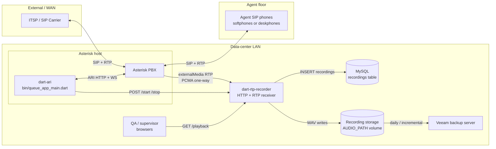

# Network Map — dart-rtp-recorder deployment

Purpose: give the networks team a single sheet to record actual link
speeds, measured throughput, and utilization for every hop the call-
recording pipeline depends on. All bandwidth figures below are
computed from the 30-concurrent-call / 10-min-avg workload used
throughout [RECORDER_API.md](RECORDER_API.md#codec-sizing-10-min-avg-call-6300-callsday).

Please fill in the **"To be measured"** columns and return.

---

## 1. Topology

If any of the boxes above are collapsed onto the same physical host
(e.g. `dart-ari` runs on the Asterisk box, or MySQL is on the
Asterisk host), mark it in §3 — the intra-host links can be crossed
off the list.

---

## 2. Bandwidth budget (design targets)

Baseline workload: **30 concurrent calls, G.711 a-law, 10-min avg
duration.** Peaks assume all 30 calls active simultaneously and
codec/format matching the current `RECORDER_CODEC=alaw` recommendation.

| # | Link | Protocol | Direction | Payload/call | Peak (30 calls) | Notes |
|---|---|---|---|---|---|---|
| L1 | ITSP ↔ Asterisk | SIP (UDP/TCP) + RTP (UDP) | bidirectional | ~87 kbps each way (G.711 + IP/UDP/RTP overhead) | **~2.6 Mbps each way** | Existing carrier link; unchanged by recorder |
| L2 | Agents ↔ Asterisk | SIP + RTP | bidirectional | ~87 kbps each way | **~2.6 Mbps each way** | Same as L1 but on the LAN side |
| L3 | Asterisk → Recorder (`externalMedia`) | RTP (UDP) | **one-way** | ~87 kbps | **~2.6 Mbps** | The new stream this project adds. G.711 a-law, 50 pps, 160-byte payload |
| L4 | dart-ari → Recorder | HTTP (TCP) | request/response | ~1 KB per `/start` + ~1 KB per `/stop` | **negligible** (<10 kbps) | Two round-trips per call |
| L5 | dart-ari ↔ Asterisk | ARI HTTP + WebSocket | bidirectional | small JSON events | **<50 kbps** | Stasis event stream, control commands |
| L6 | Recorder → MySQL | MySQL wire (TCP 3306) | mostly writes | ~1 KB per finalized call | **negligible** | ~30 inserts / 10 min = 0.05 QPS |
| L7 | Recorder ↔ Storage (`AUDIO_PATH`) | Local FS or SMB/NFS if remote | mostly writes | ~30 KB/s aggregate | **~240 KB/s = 2 Mbps** | 50 packet writes/sec/call × 30 calls, NTFS coalesces to ~4 KiB blocks |
| L8 | QA browsers → Recorder (`/playback`) | HTTP (TCP) | mostly downloads | ~5 MB per 10-min a-law WAV; ~10 MB PCM cache | **burst 100-500 Mbps** during QA review windows | Range requests supported; multiple concurrent reviewers |
| L9 | Recorder storage → Veeam | Veeam wire (TCP, usually 2500/6162/etc.) | reads | see backup table in §4 | **~940 Mbps sustained target** for full backup | 1 GbE minimum per §5.2 of the ops plan |

### 2.1 Where the numbers come from

- G.711 on-wire: 64 kbps codec + 12-byte RTP + 8-byte UDP + 20-byte IPv4 header per 20 ms frame = **~87.2 kbps** per one-way stream. Add L2 overhead (14 B Ethernet + 4 B FCS) for switch-port budgeting: **~93 kbps**.
- 30 concurrent × 87 kbps = **2.61 Mbps** one-way (L3).
- Playback burst is bounded by the reviewer's browser + LAN NIC, not the recorder. A single 10-min a-law WAV is 4.8 MB (or ~9.6 MB after PCM cache populate); at 1 GbE that's ~40 ms — most of the wall-clock latency is disk seek + first-byte, not link speed.
- L1 and L2 are pre-existing links; nothing about recorder deployment changes them.

---

## 3. Per-link fields for the networks team to fill in

For each link L1-L9 below, please record: NIC speed, duplex, VLAN
(if any), measured throughput (iperf3 or similar), current utilization
at peak hour, round-trip latency, and any known bottleneck. **Peak
required** is copied from §2 for context.

### L1 — ITSP ↔ Asterisk (SIP trunk)
| Field | Value |
|---|---|
| Peak required | ~2.6 Mbps each way |
| Interface on Asterisk | _(e.g. eth1)_ |
| Interface on carrier CPE | _(if any)_ |
| Link speed / duplex | ______ Mbps / ____ |
| VLAN / VRF | ______ |
| Measured throughput (iperf3, TCP) | ______ Mbps |
| Peak-hour utilization | ______ % |
| RTT p50 / p99 | ______ / ______ ms |
| Jitter (95th percentile) | ______ ms |
| QoS marking (DSCP EF for RTP?) | Y / N — ______ |
| Known bottleneck | ______ |

### L2 — Agents ↔ Asterisk (LAN)
| Field | Value |
|---|---|
| Peak required | ~2.6 Mbps each way |
| Access switch model / port speed | ______ |
| VLAN | ______ |
| Uplink speed to core | ______ Gbps |
| Peak-hour utilization | ______ % |
| RTT to Asterisk (from a phone) | ______ ms |
| PoE budget (if deskphones) | ______ |

### L3 — Asterisk → Recorder (externalMedia RTP)  ⚑ new
| Field | Value |
|---|---|
| Peak required | ~2.6 Mbps one-way |
| Interface on Asterisk (source) | ______ |
| Interface on Recorder (dest) | ______ |
| Link speed / duplex | ______ Mbps / ____ |
| Same VLAN as SIP? | Y / N |
| Path: same switch / cross-switch / cross-VLAN | ______ |
| Firewall between them? | Y / N — rules? |
| Measured throughput (iperf3 UDP, 3 Mbps target) | ______ / packets lost ______ |
| RTT p50 / p99 | ______ / ______ ms |
| Notes on packet loss / reorder | ______ |

### L4 — dart-ari → Recorder (control HTTP)
| Field | Value |
|---|---|
| Peak required | <10 kbps |
| Port | 8080 (or `HTTP_SERVER_PORT`) |
| Same host as L3? | Y / N |
| Firewall / ACL | ______ |
| TLS? | Y / N — if N, why acceptable |
| RTT p50 | ______ ms |

### L5 — dart-ari ↔ Asterisk ARI
| Field | Value |
|---|---|
| Peak required | <50 kbps |
| ARI HTTP port | 8088 (default) |
| WebSocket sustained? | Y / N |
| Same host? | Y / N |
| RTT p50 | ______ ms |

### L6 — Recorder → MySQL
| Field | Value |
|---|---|
| Peak required | negligible |
| MySQL host | ______ |
| Port | 3306 |
| Same host as recorder? | Y / N |
| Same host as Asterisk? | Y / N |
| Connection pool size | 1 (main isolate) |
| RTT p50 | ______ ms |

### L7 — Recorder ↔ AUDIO_PATH storage
| Field | Value |
|---|---|
| Peak required | ~2 Mbps write |
| Storage type | local NVMe / local SATA / SMB / NFS / iSCSI (circle one) |
| If remote: link speed | ______ Gbps |
| If remote: protocol + version | e.g. SMB3.1.1 |
| Storage host | ______ |
| Free space at deploy | ______ TB |
| Free space growth budget | 22 TB/yr for PCM · **11 TB/yr for alaw** · 2.8 TB/yr for Opus (Phase 3) |
| Snapshot policy | ______ |

### L8 — QA browsers → Recorder /playback
| Field | Value |
|---|---|
| Peak required | 100-500 Mbps burst |
| Number of concurrent reviewers (expected) | ______ |
| Reviewer LAN segment | ______ |
| Path to recorder (same VLAN? routed?) | ______ |
| Link speed to reviewer switch | ______ Gbps |
| Recorder-side NIC handles L3 + L8 + L9? | Y / N — if same NIC, note contention |

### L9 — Recorder storage → Veeam
| Field | Value |
|---|---|
| Peak required | ~940 Mbps sustained (full backup) |
| Veeam host | ______ |
| Veeam transport mode | NBD / Direct SAN / Hot-add / SMB copy (circle) |
| Link speed / duplex | ______ Gbps / ____ (1 GbE **minimum**, 10 GbE recommended for PCM tier) |
| Backup window (hours) | ______ |
| Full-backup completion time (last measured) | ______ min |
| Incremental frequency | e.g. hourly / 6-hour / daily |

---

## 4. Backup sizing reference

Copied from the storage plan for L9 context — networks team can use
these numbers to size the backup window.

| Codec | Per day (6,300 calls) | Full backup @ 1 GbE (theoretical, 112 MB/s) | @ 10 GbE (1.12 GB/s) |
|---|---:|---:|---:|
| PCM (s16le WAV) | 60.5 GB | **9 min** | **~1 min** |
| a-law WAV (current) | 30.2 GB | **~4.5 min** | ~30 s |
| Opus (Phase 3) | 7.6 GB | ~1 min | <10 s |

Incrementals are ≤ per-day figures; typical Veeam changed-block
tracking will send only the newly closed WAVs, so nightly deltas run
in a fraction of the full-backup time.

---

## 5. Host inventory (please confirm)

| Role | Hostname / IP | OS | NICs (count × speed) | Rack / location |
|---|---|---|---|---|
| Asterisk PBX | ______ | ______ | ______ | ______ |
| dart-ari (if separate) | ______ | ______ | ______ | ______ |
| dart-rtp-recorder | ______ | Windows Server (per current env) | ______ | ______ |
| MySQL / Asterisk DB | ______ | ______ | ______ | ______ |
| Recording storage (if separate from recorder) | ______ | ______ | ______ | ______ |
| Veeam server | ______ | ______ | ______ | ______ |
| Core / distribution switch | ______ | ______ | ______ | ______ |
| ITSP CPE / SBC (if any) | ______ | ______ | ______ | ______ |

---

## 6. Questions we'd like answers to

1. Is the recorder ↔ Asterisk RTP path (L3) on the **same VLAN** as
   the SIP/RTP path (L1/L2), or does it cross a firewall / router?
   L3 is high packet-rate (1500 pps at 30 calls) so a stateful
   firewall in the path will show up as CPU on the firewall long
   before it shows up as bandwidth.
2. Is DSCP EF (46) marking preserved end-to-end for RTP, including on
   L3? Some `externalMedia` implementations strip it.
3. What is the sustained write throughput of the AUDIO_PATH volume?
   If it's an SMB share, the recorder's per-packet `writeFromSync`
   pattern (~1500 small writes/sec at 30 calls) can amplify SMB
   round-trips beyond what raw MB/s suggests.
4. Is the Veeam link a shared production LAN, or a dedicated backup
   VLAN / SAN fabric? Full nightly PCM backup sustained at 940 Mbps
   would saturate a shared 1 GbE segment for ~9 min.
5. Are there any WAN links between agent phones and Asterisk (remote
   agents, VPN)? If yes, L2 needs a WAN entry with round-trip
   latency and jitter separately.
